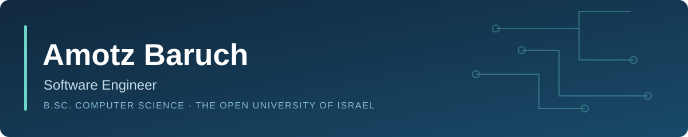

**Java / Spring Boot · Flutter · C / C++ · Python**  
B.Sc. Computer Science, The Open University of Israel · Haifa, Israel

[LinkedIn](https://www.linkedin.com/in/amotz-baruch-63593919a) · [Email](mailto:amotzbr@gmail.com)

## Engineering focus

I build backend services, mobile applications and hardware-connected products. My work spans application code, embedded firmware and hands-on prototyping, with an emphasis on connecting the layers into a working product.

I'm the **Founder & Full-Stack Engineer at ChipPaw**. I completed my **B.Sc. Computer Science in May 2026**, and speak Hebrew (native), English and Spanish (full professional proficiency).

## ChipPaw

**Pet-microchip scanning and lost-pet recovery.** My final-year project, graded **100**, grew into an active venture connecting a scanner, a mobile app and backend services.

| Layer | My work |
| --- | --- |
| Backend | Java / Spring Boot services, PostgreSQL, authentication, pet and owner management, and lost-pet reporting |
| Mobile | Flutter application, BLE scanner integration, scan notifications, battery telemetry and push notifications |
| Embedded & hardware | Device control, embedded firmware, custom antennas and hardware prototyping |

*ChipPaw's source repository remains private.*

## Public projects

<table>
<tr>
<td width="50%" valign="top">
<h3><a href="https://github.com/amotzbr/MessageU">MessageU</a></h3>

Academic client-server messenger with a custom binary protocol, persistent message storage, encryption and a documented threat model.

<code>C++</code> <code>Python</code> <code>TCP</code> <code>SQLite</code>

</td>
<td width="50%" valign="top">
<h3><a href="https://github.com/amotzbr/login-security-lab">Login-Security Lab</a></h3>

Local experiments comparing password hashing and configurable login defenses against brute-force and password-spraying scripts.

<code>Python</code> <code>Flask</code> <code>Argon2id</code> <code>TOTP</code>

</td>
</tr>
<tr>
<td width="50%" valign="top">
<h3><a href="https://github.com/amotzbr/xv6-kernel-extensions">xv6 Kernel Extensions</a></h3>

Kernel system calls, process inspection and mount-namespace work in a teaching operating system.

<code>C</code> <code>xv6</code> <code>Operating Systems</code>

</td>
<td width="50%" valign="top">
<h3><a href="https://github.com/amotzbr/advanced-java">Advanced Java</a></h3>

Java and JavaFX projects covering OOP, MVC, generics, parsers and data structures.

<code>Java</code> <code>JavaFX</code> <code>OOP</code>

</td>
</tr>
</table>

## Technical toolkit

| Area | Technologies |
| --- | --- |
| Backend & data | Java 21, Spring Boot 3, REST APIs, JPA / Hibernate, PostgreSQL, SQLite, Flyway |
| Mobile & integration | Flutter, Dart, BLE, Firebase Cloud Messaging, Google sign-in |
| Systems & networking | C, C++, Linux, xv6, TCP / UDP, multithreading, binary protocols |
| Tools & foundations | Git, GitHub, Maven, Postman, unit testing, OOP, design patterns |
