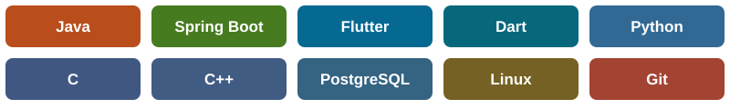

<h1 align="center">I'm Amotz Baruch</h1>
<h3 align="center">Software Engineer | Java / Spring Boot · Flutter · Systems</h3>

  <a href="https://www.linkedin.com/in/amotz-baruch-63593919a">LinkedIn</a> ·
  <a href="mailto:amotzbr@gmail.com">Email</a>

### About me

I'm a Computer Science graduate from **The Open University of Israel**, based in **Haifa, Israel**. I build backend services, mobile applications and hardware-connected products, with hands-on work from application code to embedded firmware.

- 🎓 **B.Sc. Computer Science**, awarded May 2026
- 🐾 **Founder & Full-Stack Engineer at ChipPaw**, a pet-microchip scanning and lost-pet recovery venture
- 💻 My work spans **Java / Spring Boot**, **Flutter**, **C / C++** and **Python**
- 🌍 Hebrew (native), English and Spanish (full professional proficiency)

---

### What I'm building: ChipPaw

ChipPaw grew from my final-year project, graded **100**, into an active venture connecting a pet-microchip scanner with a mobile app and backend services.

My work includes:
- Building a **Flutter mobile app** and **Java / Spring Boot backend** with PostgreSQL.
- Connecting the app to scanner hardware through **Bluetooth Low Energy**, including scan notifications, battery telemetry and device control.
- Developing pet and owner management, lost-pet reporting, authentication and push notifications.
- Bringing software, embedded firmware and hardware prototyping together into a working product.

*The ChipPaw source repository is private.*

---

### Selected public projects

| Project | What it demonstrates | Stack |
| --- | --- | --- |
| [MessageU](https://github.com/amotzbr/MessageU) | Academic client-server messenger with a custom binary protocol, persistent message storage, encryption and a documented threat model. | C++, Python, TCP, SQLite |
| [Login-Security Lab](https://github.com/amotzbr/login-security-lab) | Local experiments comparing password hashing and configurable login defenses against brute-force and password-spraying scripts. | Python, Flask, bcrypt, Argon2id, TOTP |
| [xv6 Kernel Extensions](https://github.com/amotzbr/xv6-kernel-extensions) | Kernel system calls, process inspection and mount-namespace work in a teaching operating system. | C, xv6 |
| [Advanced Java](https://github.com/amotzbr/advanced-java) | Java and JavaFX projects covering OOP, MVC, generics, parsers and data structures. | Java, JavaFX |

---

### Technical skills

  

| Area | Technologies |
| --- | --- |
| Backend & data | Java 21, Spring Boot 3, REST APIs, JPA / Hibernate, PostgreSQL, SQLite, Flyway |
| Mobile & integration | Flutter, Dart, BLE, Firebase Cloud Messaging, Google sign-in |
| Systems & networking | C, C++, Linux, xv6, TCP / UDP, multithreading, binary protocols |
| Tools & foundations | Git, GitHub, Maven, Postman, unit testing, OOP, design patterns |

---

### Connect with me

- [LinkedIn](https://www.linkedin.com/in/amotz-baruch-63593919a)
- [amotzbr@gmail.com](mailto:amotzbr@gmail.com)
